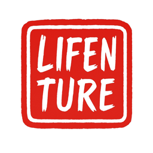

# Translate Extension

A Safari web extension that allows users to quickly translate web pages using their choice of translation provider (Kagi Translate or Google Translate).

## Features

- 🌍 **Multi-language support** - Choose up to 5 preferred languages from 100+ options
- 🔄 **Provider choice** - Select between Kagi Translate or Google Translate as your translation service
- ⚙️ **Dynamic configuration** - Customizable language selection via settings page
- 🔍 **Smart search** - Find languages by name, native name, or language code
- 🏳️ **Visual flags** - Country flags for easy language identification
- 🦘 **Safari Web Extension** format for macOS with cross-browser compatibility
- 🔒 **Minimal permissions** - only accesses tabs and storage
- 🎨 **Clean UI** with responsive design and animations
- 🌙 **Dark mode support** with system color scheme adaptation
- 💾 **Settings sync** - Preferences synchronized across browser instances

## How it Works

### Basic Usage
1. Click the extension icon in Safari's toolbar
2. Choose from your configured translation languages (up to 5)
3. The current page URL is sent to your selected translation provider
4. Automatically redirects to the translation service with your target language

### Configuration
1. Click the extension icon and select "⚙️ Settings"
2. **Choose Translation Provider:**
   - **Kagi Translate** (default) - Privacy-focused translations using Kagi's FastGPT
   - **Google Translate** - Fast and reliable translations using Google's service
3. Choose up to 5 preferred languages from 100+ options
4. Use search to find languages by name, native name, or code
5. Save settings - they sync across browser instances
6. Your popup will show buttons for selected languages

### Translation Providers

#### Kagi Translate (Default)
- **URL Pattern:** `https://translate.kagi.com/translate/{language}/{encoded-url}`
- **Features:** Privacy-focused, no tracking, powered by FastGPT
- **Best for:** Users who prioritize privacy and high-quality AI translations

#### Google Translate
- **URL Pattern:** `https://translate.google.com/translate?sl=auto&tl={language}&hl=en-US&u={encoded-url}&client=webapp`
- **Features:** Fast, reliable, extensive language support
- **Best for:** Users who want maximum speed and reliability

## Usage Notes

### Provider Selection
- **Default:** Kagi Translate is selected by default for new installations
- **Switching:** Change providers anytime in Settings - takes effect immediately
- **URL Handling:** Each provider uses its own URL format and parameters
- **Language Codes:** Automatic mapping ensures compatibility (e.g., `zh` → `zh-CN` for Google)

### Provider-Specific Behavior
- **Kagi:** Uses clean URL structure with language codes as path segments
- **Google:** Uses query parameters with `sl=auto` for source language detection
- **Fallback:** If translation fails and no languages are configured, extension opens the settings page

### Smart Domain Detection
- **Translation Sites:** Extension automatically disables on both Kagi and Google Translate domains
- **Translated Pages:** Detects when viewing Google Translate translated pages and prevents double-translation
- **Google .translate.goog:** Recognizes Google's translated page domains (e.g., `example-com.translate.goog`)
- **Widget Detection:** Recognizes Google Translate widgets and embedded translation frames
- **API Domains:** Identifies Google Translate API domains (translate.googleusercontent.com, translate-pa.googleapis.com)

### Settings Persistence
- Provider choice is saved to browser storage and syncs across instances
- Language selections work with both providers
- Settings page displays current provider selection
- No data loss when switching between providers
- After saving settings, automatically returns to the original tab

## Installation

### Safari (macOS)

1. Open the project in Xcode
2. Build the project (`Cmd+B`)
3. Open Safari
4. Go to Safari → Settings → Extensions
5. Enable "Translate Extension"
6. The extension icon will appear in the Safari toolbar

### Chrome/Edge/Brave (Cross-Browser Support)

The extension works in Chrome, Edge, Brave, and other Chromium-based browsers. **Unlike Safari, these browsers do not require the Safari app container** - you can load the extension directly from built files.

#### Method 1: Automated Build Script (Recommended)

Use the automated build script for best compatibility:

```bash
# Build the Chromium-compatible extension
npm run copy-chromium

# Optional: Test the build
npm run test-chromium

# Legacy commands (still work)
npm run copy-chrome
npm run test-chrome
```

**Load in Chrome:**
1. Open `chrome://extensions/`
2. Enable "Developer mode" (toggle in top-right)
3. Click "Load unpacked"
4. Select the `chromium-extension` folder

**Load in Edge:**
1. Open `edge://extensions/`
2. Enable "Developer mode" (toggle in left sidebar)
3. Click "Load unpacked"
4. Select the `chromium-extension` folder

**Load in Brave:**
1. Open `brave://extensions/`
2. Enable "Developer mode"
3. Click "Load unpacked"
4. Select the `chromium-extension` folder

#### What the Build Script Does

The `build-chromium.js` script creates a Chromium-compatible version by:

- **Copying extension files** from Safari extension to `chromium-extension` directory
- **Converting manifest.json** for Chromium MV3 compatibility (service worker instead of scripts)
- **Fixing service worker issues** - removes `"type": "module"` and inlines dependencies
- **Adding browser polyfill** for cross-browser API compatibility
- **Resolving CSP violations** - creates external script files instead of inline scripts
- **Creating isolated build** that doesn't interfere with Safari version

#### Chrome Service Worker Fixes

The build script addresses common Chrome extension issues:

- **Service worker registration failed (Status Code: 15)** - Fixed by removing ES modules
- **Content Security Policy violations** - Fixed by using external script files
- **Import statement errors** - Fixed by inlining all dependencies

#### Method 2: Manual Installation (Alternative)

If you prefer manual installation:

1. **Build Safari extension first:**
   - Open `Translate.xcodeproj` in Xcode
   - Build the project (`Cmd+B`)

2. **Load in browser:**
   - Navigate to: `build/Debug/TranslateExtension.appex/Contents/Resources/`
   - Note: May require manifest adjustments for full compatibility

#### Key Differences from Safari

| Aspect | Safari | Chrome/Edge/Brave |
|--------|--------|--------------------|
| **App Container** | Required macOS app | Direct file loading |
| **Installation** | App Store or Xcode build | Developer mode only |
| **Background** | Script array | Service worker |
| **Polyfill** | Native browser API | Chrome API mapping |
| **Updates** | Automatic via app | Manual rebuild/reload |

#### Browser Compatibility

- ✅ **Chrome** - Full support with automated build
- ✅ **Edge** (Chromium) - Full support
- ✅ **Brave** - Full support
- ✅ **Opera** - Should work (untested)
- ✅ **Vivaldi** - Should work (untested)
- ✅ **Firefox** - Manifest V3 compatible

#### Development Workflow

After making changes to the extension:

```bash
# 1. Rebuild the extension
npm run copy-chromium

# 2. Reload in browser
# Go to chrome://extensions/ and click refresh on the extension
```

#### Troubleshooting

**Extension Not Loading:**
- Ensure Developer mode is enabled
- Verify you're selecting the `chromium-extension` folder
- Check that manifest.json exists in selected folder

**Service Worker Errors:**
- Use the automated build script (fixes most issues)
- Check console in `chrome://extensions/` → Inspect service worker
- Ensure no import statements in background.js

**CSP Violations:**
- Automated build creates external script files
- No inline scripts should be present
- Check that `chrome-polyfill.js` exists

**Permission Errors:**
- Extensions in developer mode have different permission handling
- Required permissions: `activeTab`, `tabs`, `storage`, `windows`
- Host permissions auto-granted for translation services

#### Limitations

- **Developer Mode Only** - Chrome/Edge installation requires developer mode
- **Not Store-Distributed** - This is a Safari-first extension
- **Manual Updates** - Updates must be applied by rebuilding
- **Testing Purpose** - Primarily for development and testing

## Development

### Project Structure

```
Translate/
├── TranslateExtension/                     # Safari Web Extension
│   ├── Resources/                          # Extension files (source)
│   │   ├── manifest.json                   # Extension manifest (MV3)
│   │   ├── popup.html                      # Extension popup UI
│   │   ├── popup.css                       # Popup styling
│   │   ├── popup.js                        # Dynamic popup functionality
│   │   ├── background.js                   # Background script
│   │   ├── options.html                    # Settings/configuration page
│   │   ├── options.css                     # Settings page styling
│   │   ├── options.js                      # Settings page functionality
│   │   ├── languages.js                    # 100+ language definitions
│   │   ├── images/                         # Extension icons
│   │   └── _locales/en/messages.json       # Localization
│   ├── SafariWebExtensionHandler.swift     # Swift extension handler
│   └── Info.plist                          # Extension metadata
├── Translate/                              # macOS app container
├── chromium-extension/                     # Built Chromium extension (generated)
├── build-chromium.js                       # Chromium build automation script
├── package.json                            # NPM configuration
└── Translate.xcodeproj                     # Xcode project
```

### Development Workflow

#### For Safari Development
1. Make changes to source files in `TranslateExtension/Resources/`
2. Build in Xcode (`Cmd+B`)
3. Test in Safari

#### For Chromium Development
1. Make changes to source files in `TranslateExtension/Resources/`
2. Run `npm run copy-chromium` to rebuild Chromium extension
3. Load the `chromium-extension/` directory in browser's developer mode
4. Test your changes
5. Reload extension in browser after each rebuild

### Technologies Used

- **Manifest V3** - Modern web extension format
- **Safari Web Extensions** - Native Safari extension support
- **JavaScript ES6+** - Modern JavaScript with async/await
- **Swift** - macOS app container
- **CSS3** - Modern styling with dark mode support
- **Node.js** - Build automation for Chrome extensions

### Key Features

#### Permissions
- `activeTab` - Access to the currently active tab
- `tabs` - Ability to update tab URLs
- `storage` - Store user preferences and settings
- `https://translate.kagi.com/*` - Host permission for Kagi Translate
- `https://translate.google.com/*` - Host permission for Google Translate

#### Browser Compatibility
- ✅ **Safari** (primary target) - Native macOS app
- ✅ **Chrome** - Full support via automated build script
- ✅ **Edge** (Chromium) - Full support via automated build script
- ✅ **Brave** - Full support via automated build script
- ✅ **Firefox** - Manifest V3 compatible
- ✅ **Opera/Vivaldi** - Should work with Chromium builds

## Building

### Safari Extension (Primary)

1. Open `Translate.xcodeproj` in Xcode
2. Select the "TranslateExtension" target
3. Build the project (`Product` → `Build` or `Cmd+B`)
4. The extension will be built to `build/Debug/TranslateExtension.appex`

### Chrome/Chromium Extensions (Automated)

Use the automated build scripts for Chrome-compatible extensions:

```bash
# Build Chromium extension
npm run copy-chromium

# Test the build (optional)
npm run test-chromium

# Alternative: Run build script directly
node build-chromium.js

# Legacy commands (still work)
npm run copy-chrome
npm run test-chrome
```

#### What the Build Script Does

The `build-chromium.js` script automates the Chromium extension build process:

1. **Cleans the target directory**: Deletes the existing `chromium-extension/` directory and recreates it
2. **Copies all source files**: Copies all files from `TranslateExtension/Resources/` to `chromium-extension/`
3. **Sets up vendor dependencies**: Ensures the `vendor/` directory exists and creates a minimal browser polyfill if needed
4. **Applies patches**: Modifies specific files for Chromium compatibility:
   - **manifest.json**: Converts Safari extension format to Chromium MV3 format (changes `scripts` array to `service_worker`)
   - **background.js**: Adds necessary import statements for browser polyfill and languages.js

#### Key Changes Applied

**Manifest.json Patches:**
- Converts `"background": {"scripts": [...]}` to `"background": {"service_worker": "background.js"}`
- Maintains Chrome MV3 compatibility

**Background.js Patches:**
- Adds `import './vendor/browser-polyfill.min.js';`
- Adds `import './languages.js';`
- Ensures Chrome compatibility with ES modules

#### Browser Polyfill

The build script automatically creates a minimal browser polyfill if one doesn't exist. This polyfill simply maps the `browser` API to Chrome's `chrome` API for compatibility.

#### Build Notes

- The build script is idempotent - it can be run multiple times safely
- All files are copied fresh on each build, ensuring a clean state
- The `chromium-extension/` directory should not be edited directly as it will be overwritten

## Testing

1. Build the extension
2. Load it in Safari or Chrome
3. Visit any website
4. Click the extension icon
5. Configure your preferred languages in Settings (if not already done)
6. Select a language to translate to
7. Verify it redirects to the appropriate translation service URL

## Contributing

1. Fork the repository
2. Create a feature branch
3. Make your changes
4. Test thoroughly
5. Submit a pull request

## License

MIT License - see LICENSE file for details

## Migration Notes

### Upgrading to v1.3.0+ (Provider Choice)

**Existing users:** Your settings remain unchanged - Kagi Translate continues as the default provider.

**New options available:**
- Translation provider selection in Settings
- Google Translate alternative with different URL pattern
- Enhanced host permissions for both services

**No action required:** Default behavior is preserved for existing installations.

## Version History

- **1.4.0** - Translation Counter & Support Integration
  - 📊 **Translation counter** - Track pages translated with persistent storage
  - 💝 **Support project button** - Direct Stripe integration for extension support
  - 🎨 **Dual-button footer** - Settings and Support buttons in vertical layout
  - 🟢 **Fresh green styling** - Support buttons use attractive green theme
  - 📱 **Enhanced UI** - Improved button sizing and responsive design
  - 🔧 **Shared utilities** - Centralized support configuration reduces code duplication
  - 🎯 **Motivational UX** - Counter encourages continued usage
  - 🛡️ **Clean manifest** - Removed excessive CSP permissions following security best practices
  - 💳 **Production payments** - Live Stripe checkout for real support transactions

- **1.3.0** - Provider Choice Feature
  - 🔄 **Provider selection** - Choose between Kagi Translate and Google Translate
  - 🎛️ **Enhanced settings** - Provider choice UI in options page
  - 🔗 **Google URL pattern** - Proper Google Translate URL formatting with query parameters
  - 🔒 **Updated permissions** - Added Google Translate host permission
  - 🛡️ **Backward compatibility** - Existing users keep Kagi as default
  - 🎯 **Smart URL building** - Dynamic URL generation based on selected provider
  - 🌐 **Language code mapping** - Automatic mapping for Google Translate compatibility

- **1.2.0** - Google Translate Host Permission
  - 🌐 Added `https://translate.google.com/*` to host permissions
  - 🔄 Enhanced translation service compatibility

- **1.1.0** - Configuration & Multi-language Support
  - ⚙️ Dynamic language configuration (up to 5 languages)
  - 🔍 Smart search across 100+ languages
  - 🏳️ Visual language flags and native names
  - 💾 Settings synchronization via browser storage
  - 📱 Responsive settings page with live preview
  - 🎨 Enhanced popup with dynamic button generation
  - 🔧 Background script improvements for direct toolbar clicks

- **1.0.0** - Initial release
  - Basic translation functionality
  - Safari Web Extension format
  - Manifest V3 compatibility
  - Clean popup interface
  - Dark mode support

---

<div align="center">
  <a href="https://lifenture.com" target="_blank" rel="noopener noreferrer">
    
  </a>
</div>
